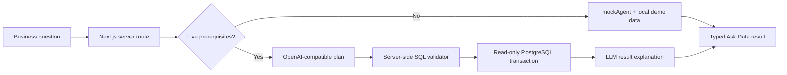

# DataPilot

DataPilot is an AI-first business data agent for asking operational questions in natural language and getting back a concise explanation, SQL, and visualization. It is an independent portfolio project and is not affiliated with Pandata.

Live website : https://datapilot-ai-data-agent-oac3-ovojmwhkz-abdeliouas-projects.vercel.app/

## Architecture



The browser only calls `POST /api/agent`. It never receives provider keys, service-role credentials, or direct SQL execution access.

## Agent lifecycle

1. Understand the request on the server.
2. Inspect the known database schema.
3. Ask the configured provider for structured JSON containing read-only SQL and visualization metadata.
4. Validate the untrusted SQL against the read-only policy and allowed tables.
5. Execute it in a PostgreSQL transaction with `READ ONLY`, an 8-second statement timeout, and a 100-row policy limit.
6. Send the returned rows back to the provider for a concise business explanation.
7. Return the answer, SQL, data, visualization metadata, execution steps, duration, row count, and mode.

Only concise execution summaries are exposed. Private chain-of-thought is never requested or returned.

## Demo Mode and Live Database

Without all live prerequisites, DataPilot automatically uses `mockAgent` and the existing deterministic local dataset. The Ask Data result displays `Demo Mode`, so recruiters can test the complete workflow without credentials.

With an OpenAI-compatible API key and the dedicated read-only Postgres connection, the API selects `realAgent` and displays `Live Database`. A provider or database failure is returned as a user-safe error; it is not silently presented as a successful run.

## Stack

- Next.js 16 App Router and TypeScript
- Tailwind CSS v4
- Recharts and lucide-react
- Supabase server client and PostgreSQL `pg` client
- OpenAI-compatible HTTP API integration
- Node's built-in test runner through `tsx`

## Environment setup

Copy `.env.example` to `.env.local`.

Demo Mode requires no variables. Live mode requires all of:

```env
OPENAI_API_KEY=your_provider_key
OPENAI_BASE_URL=https://api.openai.com/v1
OPENAI_MODEL=gpt-4o-mini
NEXT_PUBLIC_SUPABASE_URL=https://your-project.supabase.co
NEXT_PUBLIC_SUPABASE_PUBLISHABLE_KEY=publishable_key_for_future_client_usage
SUPABASE_SECRET_KEY=optional_server_only_secret_key
DATAPILOT_READONLY_DB_URL=datapilot_reader_postgres_connection_string
```

`OPENAI_BASE_URL` supports compatible providers. `NEXT_PUBLIC_SUPABASE_PUBLISHABLE_KEY` is available for future browser-side Supabase usage but is not currently required by the app. Keep `SUPABASE_SECRET_KEY`, `DATAPILOT_READONLY_DB_URL`, and `OPENAI_API_KEY` strictly server-side. The secret key is not used for SQL execution. Never prefix secrets with `NEXT_PUBLIC_`.

## Supabase setup

1. Create a Supabase project.
2. Run `supabase/migrations/001_datapilot_schema.sql` in the Supabase SQL editor or through the Supabase CLI.
3. Run `supabase/seed.sql` to load the realistic customers, products, and orders.
4. Run `supabase/migrations/002_datapilot_reader_role.sql` manually. Before running it, replace `__REPLACE_WITH_GENERATED_PASSWORD__` with a strong generated password. Do not commit the password.
5. Set `DATAPILOT_READONLY_DB_URL` to a connection string using `datapilot_reader`, for example `postgresql://datapilot_reader:<PASSWORD>@<SUPABASE_DB_HOST>:5432/postgres?sslmode=require`.
6. `SUPABASE_SECRET_KEY` is optional and reserved for legitimate server-side Supabase administration; it is not required by the query executor. The publishable key may be configured for future client-side Supabase features.
7. Restart the Next.js server.

The first migration adds primary keys, foreign keys, checks, indexes, and Row Level Security. The second migration creates `datapilot_reader` with `LOGIN`, `NOSUPERUSER`, `NOCREATEDB`, `NOCREATEROLE`, `NOINHERIT`, `NOREPLICATION`, and `NOBYPASSRLS`, restricts its `search_path`, enables default read-only transactions and a 10-second timeout, and grants `SELECT` only on `public.customers`, `public.products`, and `public.orders`. It explicitly revokes write and object-creation privileges. DataPilot uses this connection inside an additional read-only transaction.

## Run locally

```bash
npm install
npm run dev
```

Open `http://localhost:3000`.

## Tests and checks

```bash
npm test
npm run lint
npx tsc --noEmit
npm run build
```

The SQL validator tests cover valid selects, joins, CTEs, unauthorized tables, comments, multiple statements, and destructive SQL such as `DROP`, `DELETE`, and `UPDATE`.

## Security model and limitations

Generated SQL is untrusted input. The validator permits only one `SELECT` or read-only `WITH` statement, rejects comments and mutation/DDL/admin keywords, restricts `FROM` and `JOIN` relations to `customers`, `products`, and `orders`, caps explicit limits at 100, and requires a limit for unaggregated `SELECT *` queries. PostgreSQL adds a read-only transaction and statement timeout.

Application-level SQL validation alone is not sufficient security for arbitrary production databases. This project now adds a dedicated `datapilot_reader` database role, but production hardening should still add structural SQL parsing, table/column allowlists, query cost controls, network isolation, audit logs, cancellation, and tenant-aware authorization. `SUPABASE_SECRET_KEY` is never used for query execution. `DATAPILOT_READONLY_DB_URL` is server-only and should never be exposed to the browser.

## Deploy to Vercel

Import the repository into Vercel, set the live environment variables in the project settings, deploy, and run the Supabase migration/seed separately. Vercel does not run the database setup automatically. Demo Mode can deploy without external credentials.

## Limitations and future improvements

The live planner currently uses a single OpenAI-compatible provider call for query planning and a second call for explanation. It does not persist live agent runs, implement authentication, or provide a schema introspection UI. Future work includes authenticated workspaces, persisted audit history, richer chart selection, query cancellation, structural SQL parsing, and additional providers.

DataPilot is an independent portfolio project and is not affiliated with Pandata.
